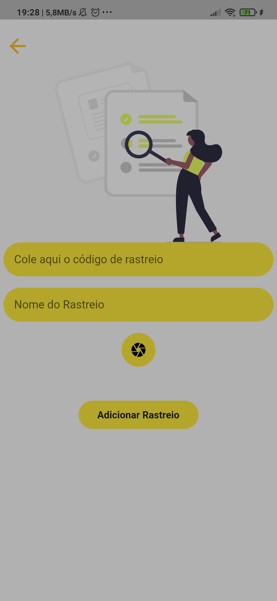
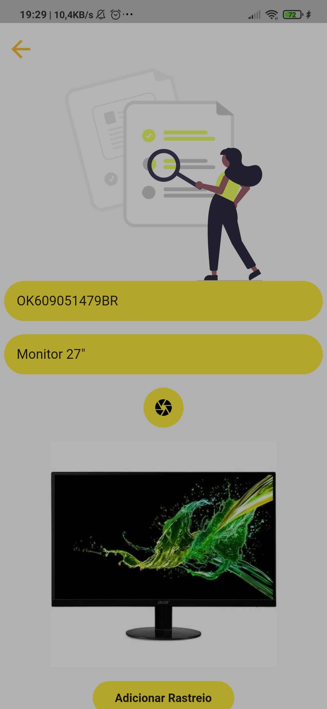
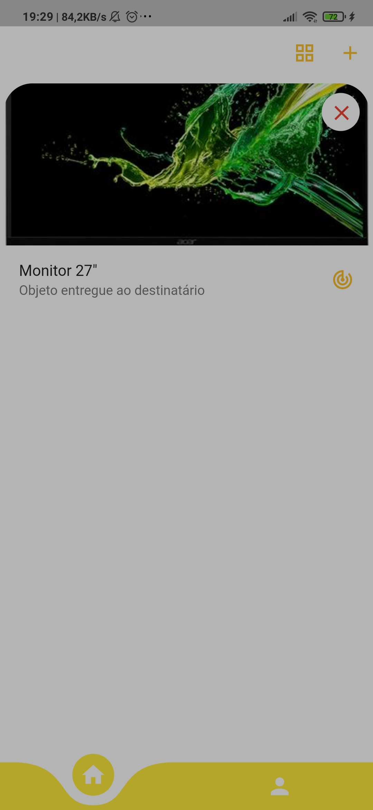
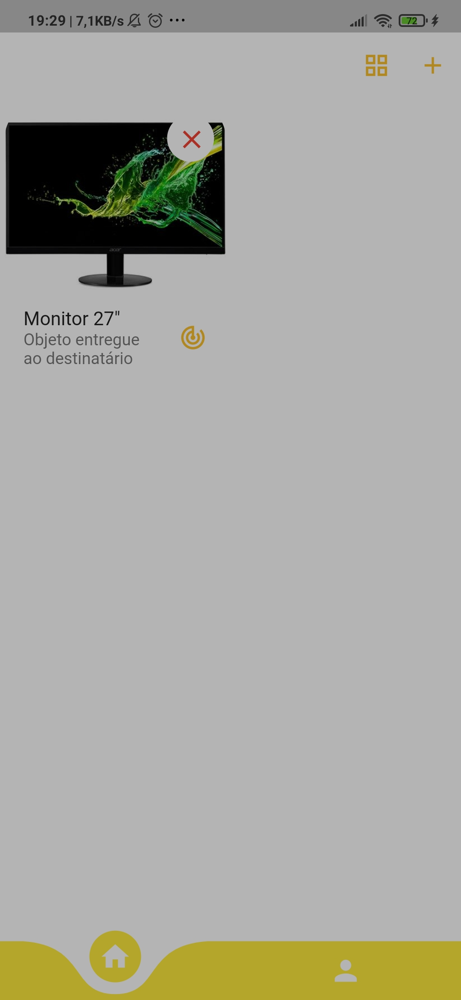
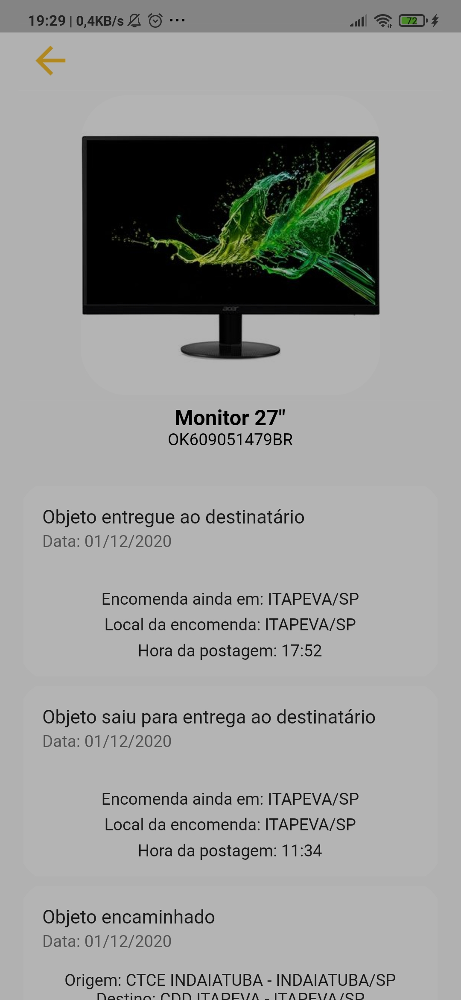

# Rastreamento Correios

## Utilidade

O App é de fácil utilização para rastreamento de encomendas do/para o Brasil. Possui um Design de interface amigavel e simples.

## Tecnologias utilizadas
- Flutter
- Firebase
- pubspec.yaml:
    - curved_navigation_bar: ^0.3.4
    - simple_animations: ^2.4.2
    - flutter_svg: 
    - image_picker: ^0.6.5+3
    - firebase_storage: "^5.0.0-dev.3"
    - cached_network_image: ^2.3.3
    - path_provider: "^1.6.18"
    - firebase_auth: ^0.18.1+1
    - cloud_firestore: ^0.14.1+3
    - http: ^0.12.2
    - firebase_analytics:
    - firebase_core: 
    - simple_splashscreen: 

<a href="./app-release.apk">Baixar Apk</a>